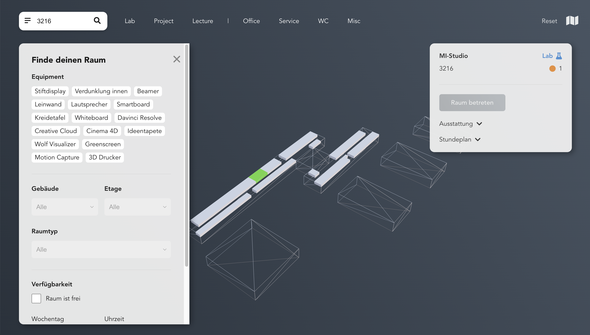
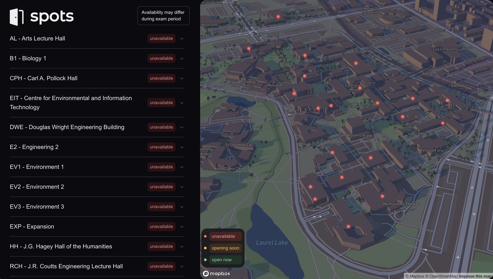
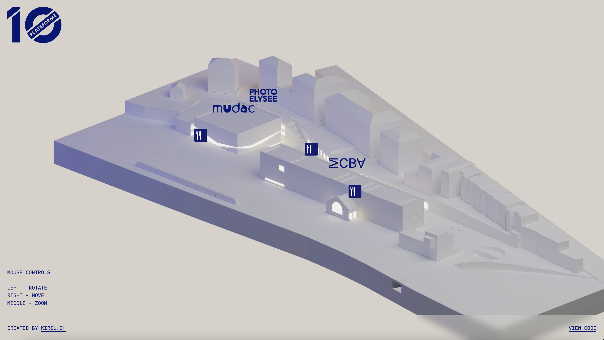
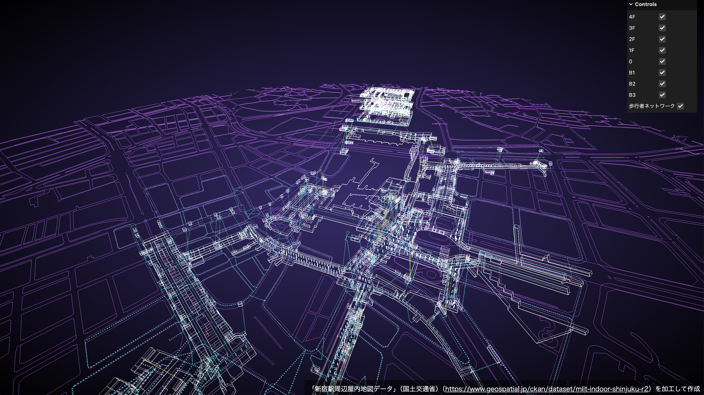

# Praxis Projekt

Konzeption und Entwicklung eines dreidimensionalen Lageplans als Web Anwendung für Information und Orientierung am Campus Gummersbach

## Problemfeld und Kontext
<!-- Wo liegt das eigentliche Problem oder Problemfeld und in welchem Kontext liegt es. Den Kontext bitte auch ein wenig analysieren und erklären. -->

Studierende im ersten Semester und welche die ein Auslandssemester absolvieren, fällt die Orientierung an Hochschulen und Universitäten nicht immer leicht. Der Campus Gummersbach der Technischen Hochschule Köln verfügt als solche über mehrere Gebäude und Räume, welche nicht immer eindeutig gekennzeichnet sind. 
Ebenfalls gibt es keine zentrale Anlaufstelle die über sämtliche Verstaltungen außerhalb der Vorlesung informiert. 

Es existieren zwar Angebote, um Studenten die Orientierung am Campus zu erleichtern, diese sind aber meistens unzureichend oder nicht bekannt. Im Hochschul-Planungs-System (HoPS) [1] der TH Köln sind Informationen nur oberflächlich zu finden. In der 26-Seitigen Erstsemester Broschüre [2] ist nur eine Seite dem Campus gewidmet, wo dieser nur grob kategorisiert ist. Gebäudepläne sind oft veraltet und existieren verschiedenen Versionen. [3]

## Zielsetzung
<!-- Wo soll die Reise hingehen und warum? -->

Das Ziel ist es, den Campus Gummersbach, in  digitaler Form darzustellen. Hierbei soll es Benutzern möglich sein, nach Räumen und Gebäudearten zu filtern. Das System soll dabei helfen den Campus besser kennen zu lernen. Neben den regulären Vorlesungen, sollen auch externe Veranstaltungen und Angebote dargestellt werden. Die Ziele werden folgendermaßen definiert:

- **Orientierung** Den Campus besser kennen lernen
- **Information** Über Veranstaltungen, Räume, Gebäude informieren
- **Akzeptanz** Das System soll von den Studierenden angenommen werden
- **Immersion** Die Darstellung soll möglichst maßstabsgetreu sein

## Aufgabenstellung
<!-- Was ist die konkrete Aufgabe oder die möglichen Aufgaben. Bei mehreren Aufgaben bitte mögliche Vor- und Nachteile abwägen. -->

1. Erstellung eines 3D Modells des Campus Gummersbach 
2. Implementierung des 3D Modells in eine Webanwendung
3. Implementierung von Navigationslementen -> Filterfunktionen

## Lösungsansätze
<!-- Mögliche Ansätze zur Problemlösung vorstellen oder Strategien aufzeigen, wie Sie zu Lösungsansätzen kommen. -->

Bestehende Lösungen von Drittanbietern
- https://www.mappedin.com/ 
- https://www.resonai.com/
- https://proximi.io/
- https://www.mapspeople.com/
- https://www.esri.com/en-us/arcgis/products/arcgis-ips/overview
- https://www.mazemap.com/
- https://www.cisco.com/c/en/us/solutions/enterprise-networks/dna-spaces/index.html
- https://www.pointr.tech/
- https://mapplic.com/wayfinding
- https://situm.com/en/
- https://www.infsoft.com/de/produkte/infsoft-wayfinding/

## Chancen und Risiken
<!-- Was kann mit dem Vorhaben erreicht werden? Welche Probleme könnten entstehen? -->

### Chancen

Eine Gebäudeplan in digitaler Form würde zahlreiche Chancen für die Technische Hochschule öffnen. Eine interaktive Karte ermöglicht es Studieninteressierten und neuen Studierenden, sich digtial auf dem Campus zu orientieren und Gebäude, Einrichtungen und wichtige Orte kennenzulernen, bevor sie überhaupt vor Ort sind.  Dies erleichtert den Einstieg und schafft von Anfang an ein Gefühl der Vertrautheit.

Durch die Bereitstellung einer solchen Anwendung kann die Hochschule ihr Ansehen steigern und sich als innovative und zukunftsorientierte Institution präsentieren.

Die Skalierbarkeit der Anwendung ist ein weiterer großer Vorteil. Zukünftig können weitere Funktionen, wie beispielsweise die Integration von Stundenplänen, Mensa-Speiseplänen oder weiteren Begeisterungsmermalen hinzugefügt werden.

### Risiken

Die Umsetzung eines digitalen Gebäudeplans kann auch mit einigen Risiken verbunden sein. Eine **unzureichende Abbildung** des Campus, beispielsweise durch einen verfälschten Maßstab oder mangelnde Detailtreue, kann die Studierene verwirren und das Benutzererlebnis beinflussen.

Um den Campus in digitaler Form darzustellen, müssen anhand der vorhanden Gebäudeplane 3D-Modelle erstellt werden. Sollte sich bei der Erstellung herausstellen, dass die vorhandenen Ressourcen unzureichend sind, kann dies den **Zeitaufwand** stark erhöhen, da manuelle Abmessungen erforderlich wären.

Traditionell werden Gebäude- oder Stadtpläne in einem größeren Format angezeigt, um eine bessere Übersicht zu garantieren. Eine große Herausforderung besteht darin den Campus in digitaler Form für einen **kleinen Bildschirm**, wie beispielsweise ein Smartphone, zu optimieren.

Damit die Akzeptanz für die Anwendung gewährleistet ist, sollte das Design ansprechend und benutzerfreundlich sein. Ein **unattraktives Design** wirkt unprofessionell und schreckt potenzielle Nutzer ab.

Da mit 3D grafiken gearbeitet wird, kann es zu **Performanceproblemen** kommen. Diese sollten minimiert werden, um ein flüssiges Benutzererlebnis zu gewährleisten.

## Ressourcen
<!-- Erste Ideen und Ansätze zu Literatur, Technologie, Kooperationspartnern vorstellen. -->

Kooperationspartner
- Hochschule -> Architekturskizzen
- Studierende -> Feedback
- Katasterservice -> Grundstückabgrenzung, nur Flurpläne
- Bauaktenarchiv NRW
- [Bebauungpläne](https://www.gummersbach.de/de/hier-zu-hause/bauen-und-wohnen/bauleitplanung/liste-aller-bebauungsplaene/bp-226.html)
- [Gebäudeplan Campus Gummersbach](https://www.th-koeln.de/mam/downloads/geb%C3%A4udeplan.pdf)

Technologien:
- Web -> Verfügbarkeit
- ThreeJS -> 3d Engine
- React -> Interaktivität
- Jotai, Zustand -> State Management
- TypeScript -> Typsicherheit
- Blender -> Modellierung
- OpenStreetMap -> Karteninformatioen
- OpenTopoMap -> Topografie  

## Motivation
<!-- Was ist Ihre persönliche Motivation sich mit dem Problem auseinander zu setzen? Warum kann dieses Problem besonders gut von einem Medieninformatiker gelöst werden? -->

- Verknüpfung der Vertiefungsmodule Web-Development und Visual Computing
- Als Student hatte ich selbst Probleme mich auf dem Campus zurechtzufinden
- Ausarbeitung des Entwicklingsprojekts

### Themen

Welche Themen sind bei den folgenden Vertiefungsmodule relevant?

**Web-Development**
- Frontend mit React
- ThreeJS
- UX/UI Design

 

**Visual Computing**

| Pre Production | Production   |  Post Production |
|---|---|---|
| Blockout, Concepting, Previz, Camera  | Modelling, Shading, Texturing, Environments, Animation | Lighting, Rendering  |

## Setup, Abhängigkeiten und Meilensteine
<!-- Kooperationspartner, Arbeitsumgebung, Prüfer, etc. vorstellen. Wen und/oder was brauche ich um das Projekt/ die Arbeit erfolgreich durchführen und abschließen zu können? -->

- Architekturskizzen der Hochschule könnten die Umsetzung eines 3D Modells erleichtern

## Arbeitsergebnis
<!-- Wie sieht das Ergebnis am Ende der Arbeit aus und wie ist es für die Zielgruppe nutzbar? -->

Das System richtet sich primär an Studierende und Studieninteressierte der Technischen Hochschule Köln, Campus Gummersbach. Es soll die Orientierung auf dem Campus erleichtern und über Veranstaltungen, Räume und Gebäude informieren. Das System soll von den Studierenden angenommen werden und eine möglichst maßstabsgetreue Darstellung des Campus bieten.

## Inspirationsquellen

## Quellen

- [1] HoPS | HochschulPlanungsSystem der TH Köln. (n.d.). HoPS | HochschulPlanungsSystem der TH Köln. Abgerufen am October 31, 2022, von https://fhpwww.gm.fh-koeln.de/hops/modules/roomequipment/room.php?room=0215
- [2] TH Köln | Informationen für Erstsemester | Fakultät für Informatik und Ingenieurwissenschaften der TH Köln. Abgerufen am October 31, 2022, von https://www.th-koeln.de/mam/downloads/deutsch/hochschule/fakultaeten/informatik_und_ingenieurwissenschaften/erstsemesterbroschure_gesamt_august_2021.pdf
- [3] https://www.th-koeln.de/hochschule/standorte_3914.php

